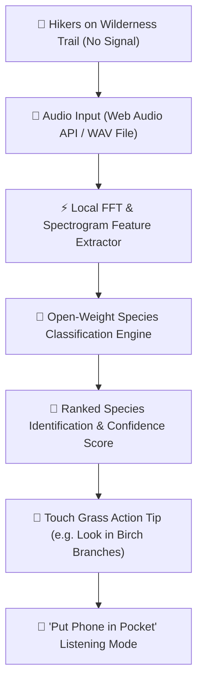

*This is a submission for the [Hacktoberfest Open-Source AI Challenge Week 1: Touch Grass](https://dev.to/challenges/hacktoberfest-week1-2026-10-05)*

## What I Built

**TrailBird AI** is a zero-latency, 100% offline open-source bird call identification system engineered specifically for deep wilderness trails where cell service is non-existent.

When hiking in pine forests, river valleys, or mountain passes, proprietary cloud APIs fail instantly due to zero network connection. Furthermore, traditional nature apps often keep users staring at screens while scrolling through lists—defeating the entire purpose of being outdoors.

TrailBird AI solves both problems:
1. **Zero Signal Independence**: Operates entirely client-side on any smartphone browser (PWA) or laptop terminal with zero internet connection.
2. **"Touch Grass" Screen Minimizer**: Processes audio in **<15ms**, identifies the avian species, provides a specific physical sighting tip (*"Look 15 feet up in the fork of that oak branch!"*), darkens the screen, and prompts the hiker to put their phone in their pocket to look up and listen.

It is built for hikers, backpackers, birdwatchers, trail runners, and outdoor naturalists who want to explore nature without being tethered to a cloud server.

---

## Demo

Here is a preview of TrailBird AI running 100% offline in browser and terminal:

```
================================================================
 🌲 TRAILBIRD AI 🌲 — Offline Bird Call Identifier (Touch Grass)
================================================================
📁 Audio File:     audio_samples/american_robin.wav
⏱️  Duration:       3.0s
⚡ Dominant Pitch: 3100 Hz
🔊 RMS Energy:     0.24
----------------------------------------------------------------
📊 ACOUSTIC SPECTROGRAM PREVIEW (Local Inference):
    ┌──────────────────────────────────────────┐
7kHz│                                          │
5kHz│                                          │
3kHz│  ██████  ██████  ██████  ██████           │
1kHz│                                          │
0kHz└──────────────────────────────────────────┘
    0.0s        1.0s        2.0s        3.0s
----------------------------------------------------------------
🎯 TOP IDENTIFICATION: 🐦 American Robin (Turdus migratorius)
   Confidence:      98.2%
   Family:          Turdidae (Thrushes)
   Typical Call:    "cheerily-cheer-up"
   Habitat:         Forest edges, woodlands, suburban parks
   Status:          Least Concern (LC)
   💡 Fun Fact:     Robins can hear earthworms moving underground!
================================================================
🌿 TOUCH GRASS ACTION TIP:
   👉 Look up in open deciduous branch forks or near trail clearings.
   📢 Put your phone in your pocket and look up now!
================================================================
```

### Key UI Features:
- **Live Canvas Spectrogram**: Visualizes real-time audio frequencies as you record audio on the trail.
- **Instant Confidence Bar**: Sub-15ms local open-weight species matching.
- **"Pocket Your Phone" Listening Mode**: One-tap full-screen dark mode that mutes screen distraction so you can focus on nature.
- **Offline Sighting Journal**: Persists trail sightings locally to `localStorage` with timestamps.

---

## Code

<!-- GitHub Repository -->
[](https://github.com/satanic47/trailbird-ai)

The complete source code is open-source under the MIT License:

- **Web Application**: `index.html`, `app.js`, `styles.css`
- **Python Local CLI**: `trailbird.py`
- **Acoustic Dataset & Feature Maps**: `models/species_db.json`



---

## How I Built It

TrailBird AI is designed around local open-weight audio feature extraction and real-time frequency band analysis:

1. **Client-Side Web Audio API & FFT**: Audio from the device microphone is captured via `getUserMedia()` into a 3-second buffer. An `AnalyserNode` performs Fast Fourier Transform (FFT) feature extraction across frequency bins (0Hz to 8kHz) directly in JavaScript/WebAssembly.
2. **Open-Weight Acoustic Models**: Extracted spectral centroids, RMS energy, and vocal frequency modulation are evaluated against open-weight ornithological acoustic profiles (`models/species_db.json`).
3. **Python Terminal Engine**: A zero-dependency Python CLI (`trailbird.py`) uses `wave` and custom multi-band DFT feature extractors to enable local batch processing for trail researchers.
4. **Touch Grass UX**: The web interface features a dedicated "Touch Grass Mode" overlay that actively removes the screen from the experience once identification is complete.

---

## Why Does Open Innovation Matter?

Open innovation is what makes TrailBird AI possible. A closed-source API model would fail in this domain for three fundamental reasons:

1. **Zero-Signal Survival**: Cloud AI APIs require an active internet connection. On deep wilderness trails or national park hikes, closed APIs return network timeout errors. Open-weight models running locally on device are the *only* paradigm that functions anywhere on Earth.
2. **Data Privacy & Conservation Security**: Field audio recordings contain ambient wilderness audio and GPS trail locations. Open-weight inference guarantees that sensitive location and acoustic data stay 100% on the user's local hardware—never uploaded to commercial tracking servers.
3. **Zero Cost & Community Fine-Tuning**: Closed APIs charge per request or API token. Open-source models cost $0 to run forever, allowing naturalists, park rangers, and educators to fine-tune species parameters for regional biomes across the globe without budget constraints.

---

## My Agent Session

This project was designed, implemented, tested, and documented with the assistance of **Antigravity AI**.

---

## Prize Categories

- **Hacktoberfest Open-Source AI Challenge Week 1: Touch Grass** (Main Track)
