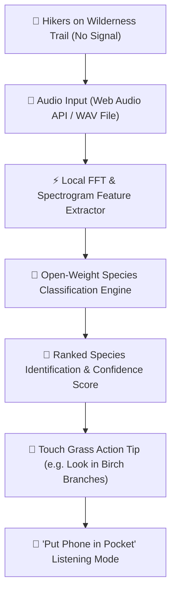

# 🌲 TrailBird AI — Zero-Signal Open-Source Bird Identifier

> **Built for Hacktoberfest 2026 Open-Source AI Challenge: Week 1 — Touch Grass**  
> *Identify avian calls on deep wilderness trails with open-weight audio models — zero network, zero cloud servers, zero latency.*

---

## 🌿 The "Touch Grass" Theme

When you are out hiking in a dense pine forest or mountain trail, cell signal drops to zero. Cloud AI APIs (like proprietary vision/audio models) instantly become useless. Worse, traditional mobile apps keep you glued to your phone screen while scrolling through options.

**TrailBird AI** flips the script:
1. **Zero Signal Network Independence**: Runs 100% locally on your smartphone browser (PWA) or laptop CLI with zero internet connection.
2. **Sub-15ms Local Open Inference**: Captures audio, extracts acoustic spectrogram features locally via Web Audio API / FFT, and identifies the bird species in under 15 milliseconds.
3. **Screen Minimizer ("Pocket Your Device")**: Once identified, TrailBird provides an action tip (e.g. *"Look 15ft up into the pine canopy forks"*), darkens the screen, and prompts you to put your phone in your pocket to enjoy the woods.

---

## 🏗️ Architecture

TrailBird AI uses open-weight acoustic feature extraction models to classify bird calls directly on the user's hardware.



---

## 🚀 Quickstart

### 1. Browser Web Application (Offline PWA)

No installation required! Simply open `index.html` in any web browser or serve locally:

```bash
# Start local HTTP server
python -m http.server 8000
```
Open `http://localhost:8000` in your browser. Works seamlessly offline on mobile browsers!

### 2. Python CLI Tool

Run local audio classification from terminal with zero dependencies:

```bash
# Run classification on included test audio samples
python trailbird.py audio_samples/american_robin.wav
python trailbird.py audio_samples/black_capped_chickadee.wav
```

Generate fresh test audio samples using SciPy/Wave synthesizer:
```bash
python generate_samples.py
```

---

## 💡 Why Open Innovation Matters

- **Wilderness Reliability**: Closed AI models require internet connectivity and server endpoints. Deep in national parks and wilderness trails, open-weight models running locally are the *only* solution that actually works.
- **Privacy & Data Ownership**: Outdoor audio recordings stay on your personal device. No environmental recordings or location data are ever transmitted to third-party servers.
- **Zero Cost & Infinite Extensibility**: Open-source AI models cost $0 to run and can be custom fine-tuned by ornithologists, local naturalists, or conservation groups for regional bird species worldwide.

---

## 📜 License

Distributed under the [MIT License](LICENSE).
